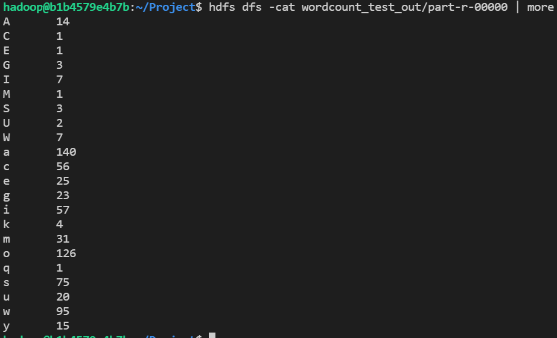
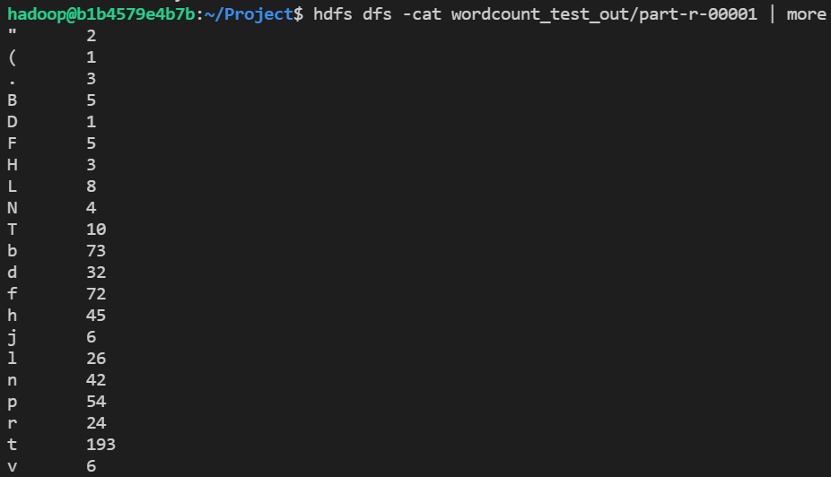

# 수정내용

## Wordcount1char.java

TokenizerMapper 클래스의 map 메서드에서 
word.set(itr.nextToken())를  word.set(itr.nextToken().substring(0,1)) 로 변경

```java
public static class TokenizerMapper extends Mapper<Object,Text,Text,IntWritable> {

		// variable declairations
		private final static IntWritable one = new IntWritable(1);
		private Text word = new Text();

		// map function (Context -> fixed parameter)
		public void map(Object key, Text value, Context context)
				throws IOException, InterruptedException {

			// value.toString() : get a line
			StringTokenizer itr = new StringTokenizer(value.toString());
			while ( itr.hasMoreTokens() ) {
				word.set(itr.nextToken().substring(0,1));
				// emit a key-value pair
				context.write(word,one);
			}
		}
	}
```

## Driver.java

pgd.addClass("wordcount1char", Wordcount1char.class, "A map/reduce program that performs word counting.");
를 추가하여, wordcount1char 실행 및 클래스를 추가한다.

```java
package ssafy;

import org.apache.hadoop.util.ProgramDriver;

public class Driver {
	public static void main(String[] args) {
		
            ...
			pgd.addClass("wordcount1char", Wordcount1char.class, "A map/reduce program that performs word counting.");
            ...
	}
}
```

## 결과
### wordcount_test_out/part-r-00000


### wordcount_test_out/part-r-00001

