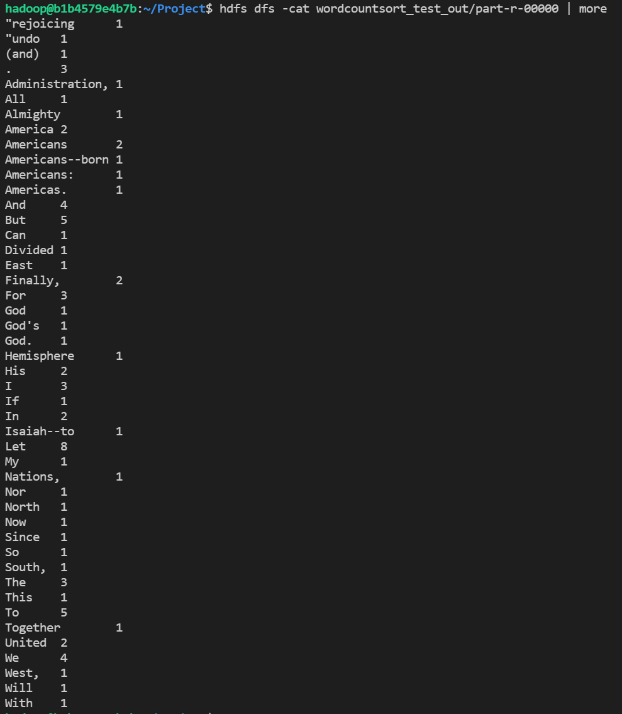
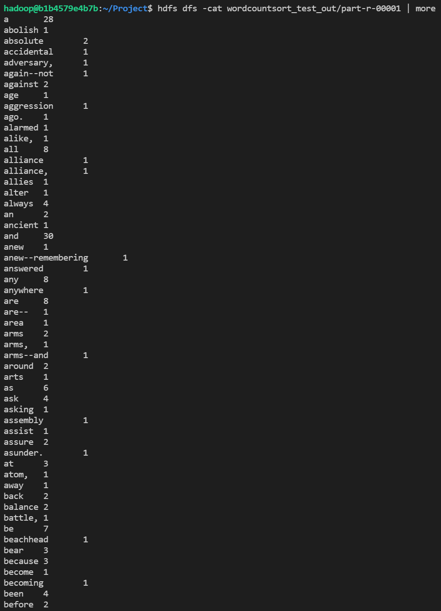

# 수정내용

## Wordcountsort.java

TokenizerMapper 클래스에서 MyPartitioner 클래스를 생성한다.


```java
public static class MyPartitioner extends Partitioner<Text, IntWritable> {
	@Override
	public int getPartition(Text key, IntWritable value, int numPartitions){
		if (key.toString().charAt(0) < 'a') return 0;
		return 1;
	}
}
```

main 함수에서 partitioner 클래스 등록하기
```java
// set partitioner
job.setPartitionerClass(MyPartitioner.class);
```

## Driver.java

pgd.addClass("wordcount1char", Wordcount1char.class, "A map/reduce program that performs word counting.");
를 추가하여, wordcount1char 실행 및 클래스를 추가한다.

```java
package ssafy;

import org.apache.hadoop.util.ProgramDriver;

public class Driver {
	public static void main(String[] args) {
		
		...
		pgd.addClass("wordcountsort", Wordcountsort.class, "A map/reduce program with Partitioner Class");
		...
	}
}
```

## 결과
확인하면 'a'를 기준으로 part-r-00000 와 part-r-00001으로 결과가 나뉘어 처리된다.
### part-r-00000


### part-r-00001

