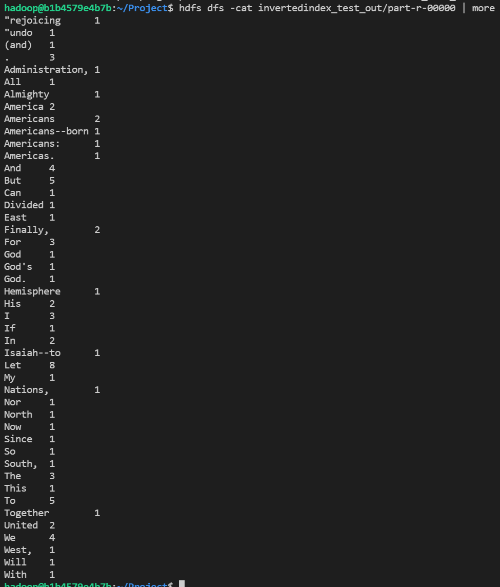
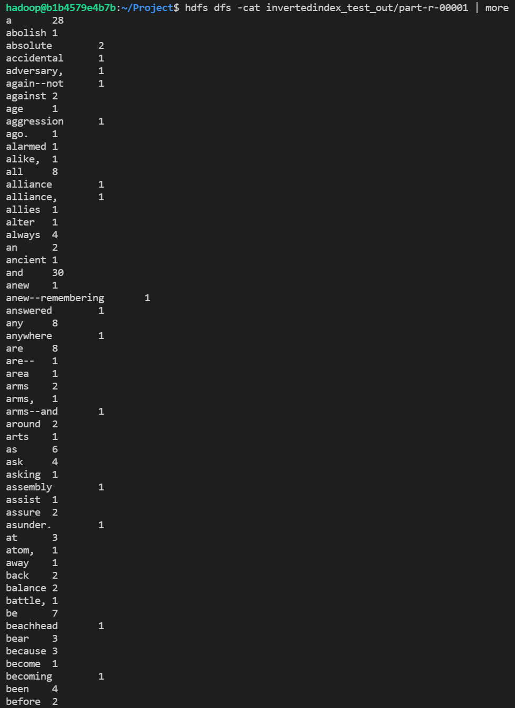

# 수정내용

## inveredIndex.java

TokenizerMapper 클래스의 map 메서드에서 
filename 과 해당 파일에서의 offset을 붙여 반환한다.


```java
public void map(Object key, Text value, Context context)
		throws IOException, InterruptedException {

	// value.toString() : get a line
	long offset = ((LongWritable)key).get();
	StringTokenizer itr = new StringTokenizer(value.toString());
	while ( itr.hasMoreTokens() ) {
		String next = itr.nextToken();
		word.set(next.trim());

		if(! next.equals(" ")){
			which.set(filename+ ":" + offset);
			context.write(word, which);
		}
		
		offset += next.length();
	}
}
```

이때 filename은 setup함수를 구현하여 map함수를 호출하기 전 설정한다.
```java
public void setup(Context context) throws IOException, InterruptedException{
	filename = ((FileSplit) context.getInputSplit()).getPath().getName();
}
```

## Driver.java

```java
package ssafy;

import org.apache.hadoop.util.ProgramDriver;

public class Driver {
	public static void main(String[] args) {
		
		...
		pgd.addClass("invertedindex", Wordcountsort.class, "A map/reduce program with Inverted Index");
		...
	}
}
```

## 결과
### part-r-00000


### part-r-00001

