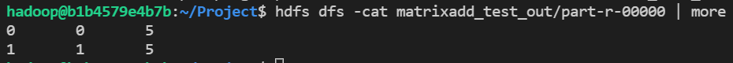
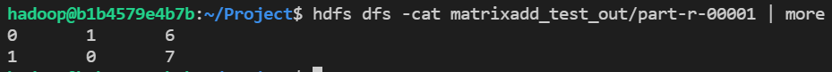

# 수정내용

## MatrixAdd.java

TokenizerMapper 클래스의 map 메서드에서 

tab을 기준으로 parsing하여 위치 arr[1], arr[2] 와 값 arr[3]을 각각 key와 value로 설정

```java
public void map(Object key, Text value, Context context)
		throws IOException, InterruptedException {

	String[] arr = value.toString().split("\t");
	Text emitKey = new Text(arr[1] + "\t" + arr[2]);
	IntWritable emitVal = new IntWritable(Integer.parseInt(arr[3]));
	context.write(emitKey, emitVal);
}
```

map에서 나눈 것을 기준으로 같은 key값을 가진것은 더해서 저장한다.
```java
public void reduce(Text key, Iterable<IntWritable> values, Context context) 
		throws IOException, InterruptedException {
	int sum = 0;
	for(IntWritable val : values){
		sum += val.get();
	}

	context.write(key, new IntWritable(sum));
}
```

## Driver.java

```java
package ssafy;

import org.apache.hadoop.util.ProgramDriver;

public class Driver {
	public static void main(String[] args) {
		
            ...
			pgd.addClass("matrixadd", MatrixAdd.class, "A map/reduce program with Matrix addition");
            ...
	}
}
```

## 결과
### part-r-00000


### part-r-00001

